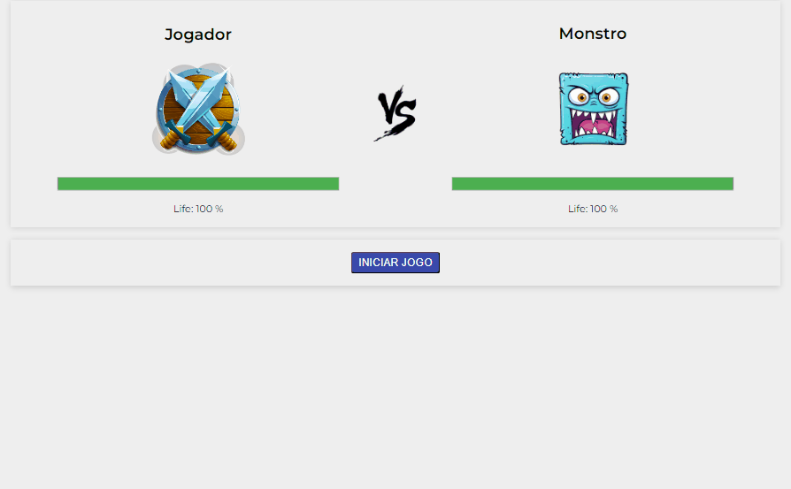

<h1 align="center">Player-vs-Monster</h1>

Player-vs-Monster é um jogo interativo construído com Vue.js, onde o jogador enfrenta uma intensa batalha contra um monstro feroz. A interface do jogo apresenta quatro ações principais:

<ul>
<li>💪 Ataque: Permite ao jogador atacar o monstro, causando dano e diminuindo a barra de vida do oponente.</li>
<li>💊 Cura: Oferece a possibilidade de recuperar parte da vida do jogador, permitindo que ele se mantenha na batalha por mais tempo.</li>
<li>💥 Ataque Especial: Um ataque mais poderoso que o ataque comum, mas que pode ser usado com moderação devido ao seu alto impacto.</li>
<li>🚪 Desistir: Caso o jogador perceba que não pode vencer, ele pode optar por desistir da batalha, encerrando o jogo.</li>
</ul>

O objetivo principal é derrotar o monstro usando uma combinação estratégica dessas ações, gerenciando a vida e os recursos do jogador de forma eficiente. Com uma interface simples e dinâmica, o Monster Battle Arena é um excelente projeto para demonstrar habilidades em Vue.js e lógica de jogo.

Para ver o projeto pronto [clique aqui 🖱️](https://clari-cassia-projetcs-player-vs-monster.vercel.app/)

<h2 align="center">Layouts: Desktop / Mobile</h2>

    
    

<h2 align="center">O que eu aprendi</h2>

Com a conclusão do meu primeiro projeto em Vue.js, aprendi a controlar o fluxo do jogo usando condicionais, como habilitar ou desabilitar ações conforme a situação exigia. Também explorei o uso de classes para aplicar estilos dinâmicos, alterando a aparência dos botões com base na saúde do jogador e do monstro.

Ao trabalhar com o objeto data, consegui gerenciar o estado do jogo, armazenando e atualizando informações críticas como a vida dos personagens. Usei watch para monitorar mudanças nesses dados, o que me permitiu ocultar ou exibir botões de acordo com a necessidade do jogo. Além disso, utilizei computed para criar resultados dinâmicos que se recalculam automaticamente à medida que os dados mudam, tornando o código mais eficiente e fácil de manter.

Esse projeto me proporcionou uma compreensão sólida de como Vue.js pode simplificar o desenvolvimento de interfaces interativas e reativas.
<h2 align="center">Tecnologias utilizadas</h2>

  
  
  

